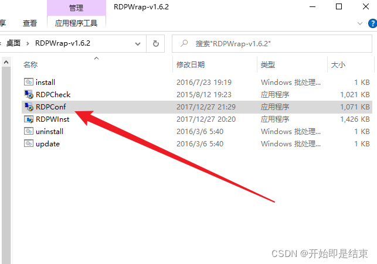

# windows多用户“同时”远程连接

> 开始即是结束
>
> 2022-04-01
>
> https://blog.csdn.net/qq_54780911/article/details/123907031

在做一些渗透测试实验的时候，发现了一个问题，在靶机里创建好账号等工作后，通过远程连接发现会提示只能一个用户登录，也就是对方已经登录了一个账号，我就不能登录。

然后查了一些资料，解决了这个问题。现在记录一下。

windows10和windows11都试过

其实windows系统自带有允许多少用户远程登录的设置

WIN+R键打开运行，输入 gpedit.msc 打开组策略编辑器

按 “计算机配置”--> “管理模板”-->“Windows组件”找到远程桌面服务

双击打开后，进入远程桌面回话主机-->连接

然后选择限制连接的数量

 选择启用，然后设置好需要的数量

设置好后还不够，系统本身是限制这个功能的，需要用工具来开启。 

接下来需要一个叫[rdpwrap][https://github.com/binarymaster/rdpwrap/releases]的工具

下载好后打开执行安装程序

 

 安装好后打开RDPConf.exe

下面就是软件界面

 必须要有四个绿色，很多时候最后一个都是红的

这是因为系统版本的原因，这个我也花了不少时间去查

然后找到了一个办法，就是换配置文件

安装这个程序的时候，它会在c盘的Program Files目录下创建一个目录

进入这个目录，会看到一个配置文件，

我们可以查看这个文件的内容

 就是这个文件太老了，不适应现在的新版本

 我们需要把这个文件删除掉换一个新的配置文件，删除的方法可以看我的这篇文章 https://blog.csdn.net/qq_54780911/article/details/123870820

 我找到了一个新的配置文件。

 这个基本适用很多系统了，将这个替换成原本的就可以了。这个文件的内容我就放在最后了，主要是太多了，大家删掉原本的文件后在新建一个文本文档，把下面的内容复制进去，该文件名为rdpwrap.ini，然后复制到原本的目录下就可以了。

再次打开那个程序

发现全都绿了

 最后重启一下电脑就可以多用户同时登录了

