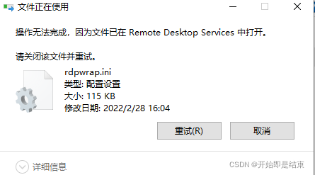
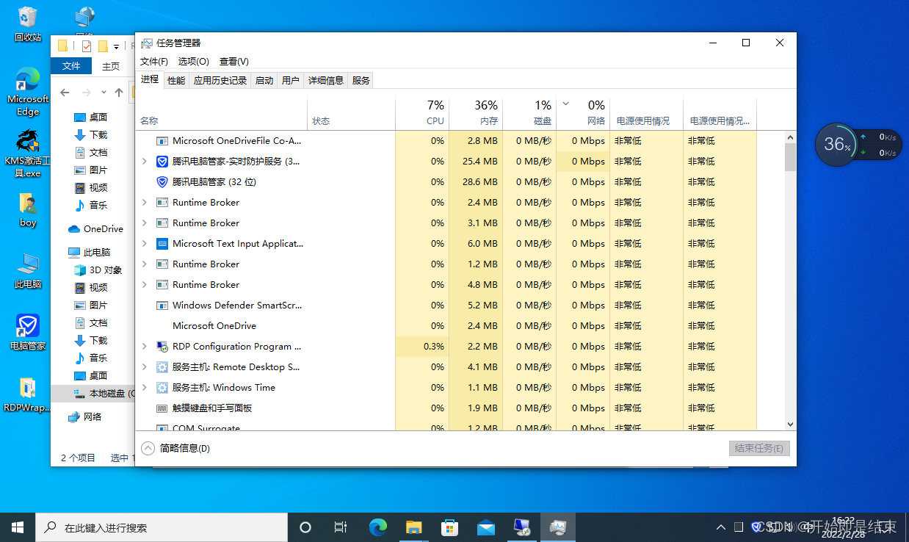
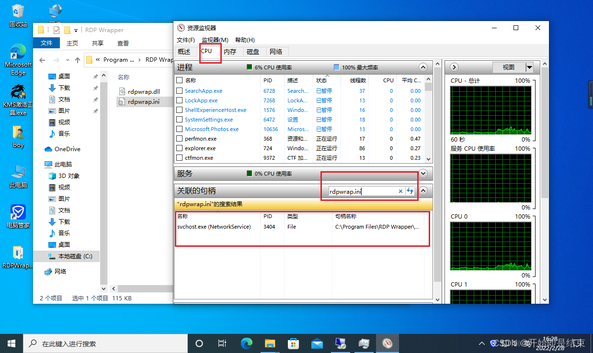
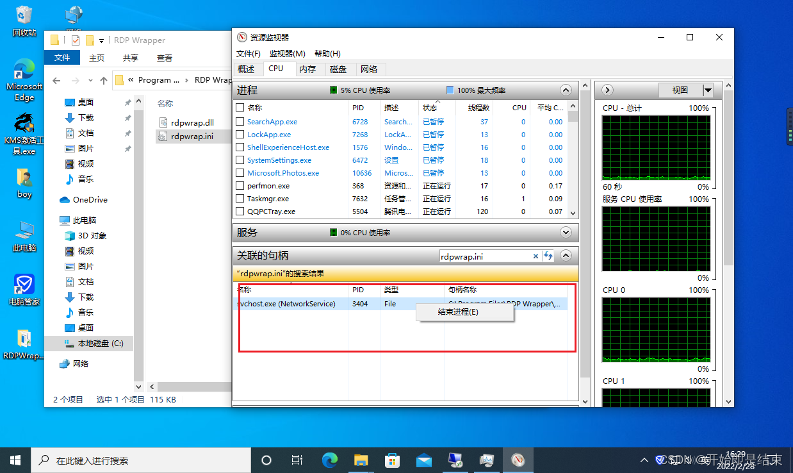
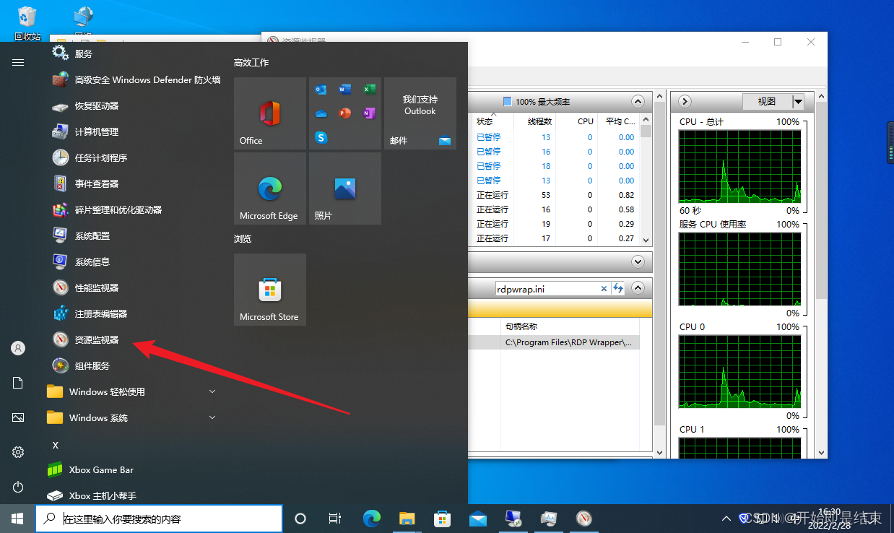
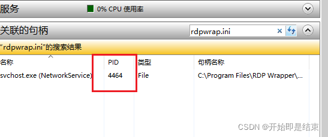
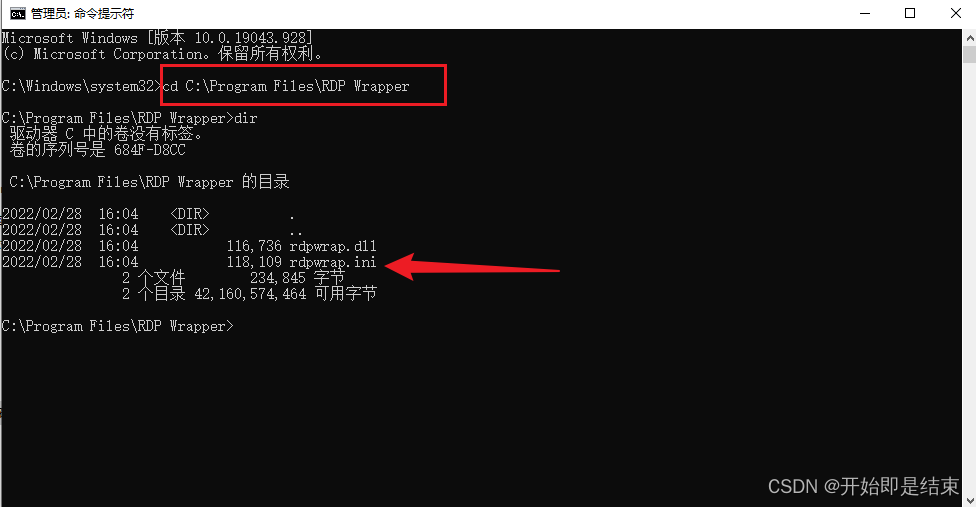
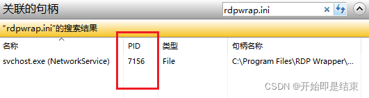
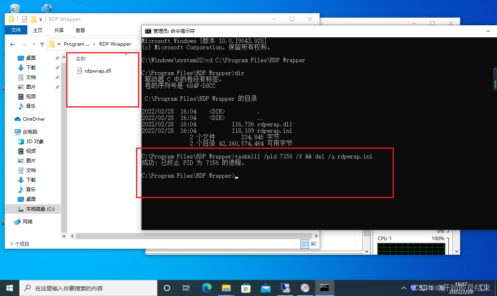

# 强制删除被占用文件 windows

> 开始即是结束
>
>  2022-03-31
>
> https://blog.csdn.net/qq_54780911/article/details/123870820

在删除文件的时候我们有时候会遇到删除文件失败的时候，显示文件已在其他地方中打开如下图



然后我们只能去关掉它，再删除当然这是理想情况下，不理想的情况下我们不能很轻易的找到它的进程

下面展示一种方法

右键单击任务栏，打开任务管理器



 然后选择性能，打开资源监视器


 在资源管理器中的CPU页面搜索被占用的文件，就能得到有关进程



 我们就可以右键结束进程了



 资源监视器还可以在开始菜单打开



正常情况下，结束进程后就可以删除掉文件了，但是有一些进程很厉害，你把它结束后，它又会自己启动，导致你没有时间删除它。

我的这个文件就是这样



 结束进程后，再刷新搜索就又见到它换了个进程id

最后我就重启系统，发现还是没效果（如果进入安全模式应该可以删除）

我认为，我删除不掉它是因为我速度太慢了，被它重新启动了。而怎么提高删除的速度呢，我想到了dos命令。

用管理员身份打开命令行窗口（如果这也不会那我也没办法了，我懒得写了）。

用cd命令进入到要删除文件的目录下



输入下面的命令，杀掉进程的同时删除文件

```powershell
taskkill /pid 7156 /f && del /q rdpwrap.ini
```

其中7156代表进程的id 即在资源管理器中的PID



 rdpwrap.ini  为要删除的文件名

下面就是执行成功的截图，文件成功被删除了


